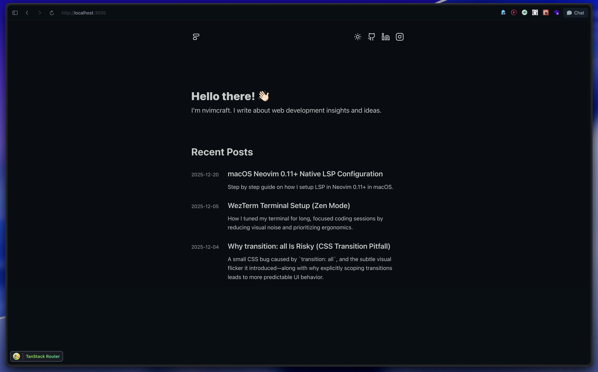

# client-mvp

## Stack

### Client

- React 19
- React Compiler
- TypeScript
- TanStack Router
- Vite

### Markdown

- MDX
- remark-gfm
- remark-mdx-frontmatter
- Shiki (syntax highlighting)

### Tooling

- pnpm
- Prettier (with import sorting)
- ESLint
- TypeScript

### License

MIT
